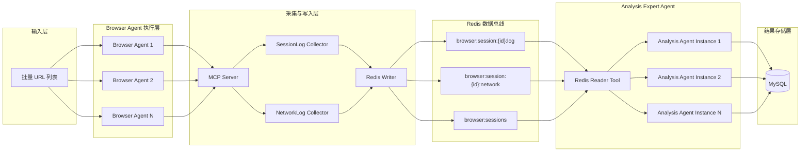

# Auto Reverse Release

## 演示视频

[](https://www.bilibili.com/video/BV1XbQrBNEYr/)

视频地址：<https://www.bilibili.com/video/BV1XbQrBNEYr/>

## 目录说明

- `main_project_backend/`：FastAPI 后端
- `main_project_front/`：Vue 3 + Vite 前端，包含 `dist/` 构建产物
- `reverse-network-mcp-server/`：Redis 会话网络逆向分析 MCP
- `roxybrowser-playwright-mcp-main/`：Playwright MCP 运行时
- `roxybrowser-mcp-server/`：RoxyBrowser MCP 运行时
- `data/`：Skills 与 skill-generator 运行时数据
- `scripts/init_mysql.sql`：MySQL 默认初始化脚本
- `INSTALL.md`：完整安装、初始化与启动说明

## 推荐阅读顺序

1. 先看 [INSTALL.md](/root/auto_reverse_release/INSTALL.md)
2. 执行 [scripts/init_mysql.sql](/root/auto_reverse_release/scripts/init_mysql.sql)
3. 安装 Python / Node 依赖
4. 启动 MySQL、Redis、后端、前端

## MCP 工具安装说明

当前 `auto_reverse_release` 目录内包含 3 个本地 MCP 子项目：

- `roxybrowser-playwright-mcp-main/`
- `reverse-network-mcp-server/`
- `roxybrowser-mcp-server/`

需要注意两件事：

- 在各子项目目录执行 `npm install`，只是安装该子项目自己的依赖
- `npx` 不会因为这些源码目录就在当前 release 下，就自动命中本地 MCP 包

也就是说，如果你希望像 `auto_reverse` 目录里的历史记录那样，让 `npx` 或 `npx --no-install` 直接调用当前 release 里的本地 MCP 工具，还需要额外执行一次本地 MCP 安装/链接。

### 1. 安装三个 MCP 子项目依赖

先把 3 个子项目依赖装齐：

```bash
npm --prefix /root/auto_reverse_release/roxybrowser-playwright-mcp-main install
npm --prefix /root/auto_reverse_release/reverse-network-mcp-server install
npm --prefix /root/auto_reverse_release/roxybrowser-mcp-server install
```

说明：

- release 包内已经带了主要 `lib/` 构建产物，通常不需要先手工 `npm run build`
- 上面这一步只是补齐运行依赖，不等于已经把 MCP 工具注册为本机可执行命令

### 2. 额外安装本地 MCP 工具

如果你要让 `npx` 直接命中当前 release 中的本地 MCP 包，请在 release 根目录执行：

```bash
cd /root/auto_reverse_release
npm install ./reverse-network-mcp-server
npm link ./roxybrowser-mcp-server ./roxybrowser-playwright-mcp-main
```

执行后，本地可执行入口通常包括：

- `reverse-network-mcp-server`
- `roxy-browser-mcp`
- `roxybrowser-mcp-server-playwright`

这部分说明参考了 `auto_reverse` 目录中的安装记录：

- `reverse-network-mcp-server` 采用“本地安装后由 `npx` 命中”的方式
- `roxybrowser-mcp-server` 与 `roxybrowser-playwright-mcp-main` 采用 `npm link` 建立本机可执行入口的方式

### 3. 验证 npx 是否命中本地 MCP

安装完成后，可在 release 根目录执行：

```bash
cd /root/auto_reverse_release
npx --no-install reverse-network-mcp-server --help
npx --no-install roxy-browser-mcp --help
npx --no-install roxybrowser-mcp-server-playwright --help
```

如果这些命令能直接输出帮助信息或正常启动，就说明当前 `npx` 已经命中本地 MCP 包，而不是回退到远端临时下载。

### 4. 安装 Playwright 浏览器运行时

`roxybrowser-playwright-mcp-main` 还需要本地 Playwright 浏览器运行时，至少安装 Chromium：

```bash
cd /root/auto_reverse_release/roxybrowser-playwright-mcp-main
npx playwright install chromium
```

### 5. 与后端默认配置的关系

当前 release 后端默认读取 [main_project_backend/mcp_servers.json](/root/auto_reverse_release/main_project_backend/mcp_servers.json)，并直接调用当前目录中的本地脚本入口：

- `/root/auto_reverse_release/roxybrowser-playwright-mcp-main/cli.js`
- `/root/auto_reverse_release/reverse-network-mcp-server/index.js`
- `/root/auto_reverse_release/roxybrowser-mcp-server/lib/index.js`

所以就“后端默认运行”来说，它本身不依赖 `npx -y` 在线拉包；但如果你要手工验证 MCP、独立调试，或者后续想切回 `npx` 调用模式，上面的“本地 MCP 工具安装”这一步仍然需要做。

### 6. 按运行模式准备 MCP

- `standalone` 模式：至少需要 `roxybrowser-playwright-mcp-main` 和 `reverse-network-mcp-server`
- `roxy` 模式：需要 3 个 MCP 都已安装，同时本机还要安装并启动 RoxyBrowser
- 即使当前只打算跑 `standalone`，也仍然建议把 `roxybrowser-mcp-server` 一并安装，后续切换模式时不用再补环境

### 7. Roxy 模式额外配置

如果要启用 `roxy` 模式，请确认：

- RoxyBrowser 本地程序已启动
- API 可访问，默认地址为 `http://127.0.0.1:50000`
- `ROXY_API_KEY` 已在 [main_project_backend/mcp_servers.json](/root/auto_reverse_release/main_project_backend/mcp_servers.json) 中正确填写

### 8. 路径迁移提醒

如果你把整个 `auto_reverse_release` 目录移动到了其他路径，需要同步修改 `mcp_servers.json` 中的绝对路径。

## 致谢

致谢项目：

- https://github.com/LunFengChen/proxypin-mcp-server

该项目给予了 `reverse-network-mcp-server` MCP 工具灵感。

依赖项目：

- https://github.com/eraserkason/roxybrowser-mcp-server
- https://github.com/eraserkason/roxybrowser-playwright-mcp


##业务流程架构


